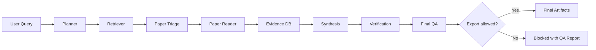
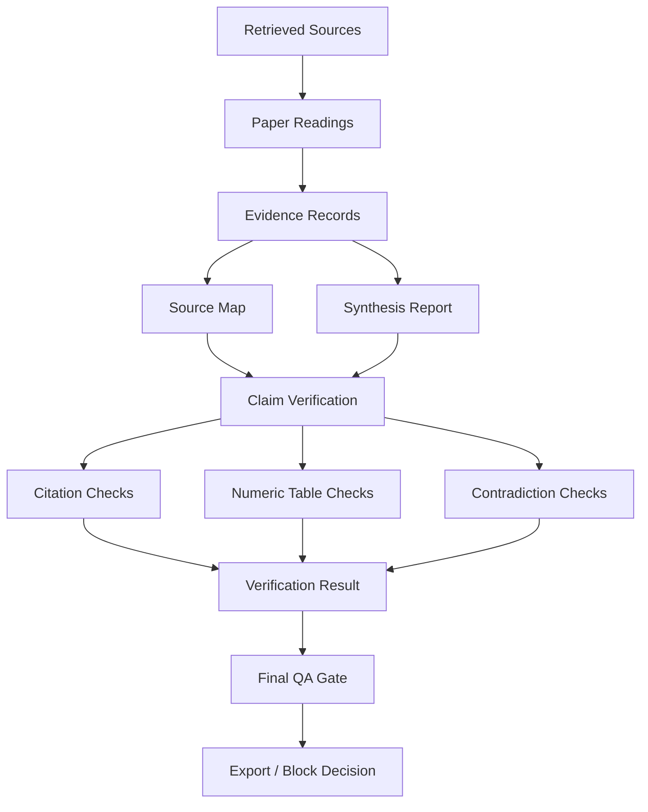

# Auto Research

[English](README.md) | [简体中文](README.zh-CN.md)

Auto Research is an evidence-grounded automated literature research workflow. It helps turn a broad research question into traceable artifacts such as retrieved papers, ranked sources, paper readings, evidence records, synthesis reports, verification reports, and final QA decisions.

The project is intentionally conservative: generated text is not treated as evidence, unsupported claims are marked or blocked, and final export can be denied when source support is weak.

## Why Auto Research

Many research-agent demos can search papers and write summaries, but they often leave important quality questions unanswered:

- Which source supports each claim?
- Did the system read full text or only metadata?
- Are numeric claims grounded in extracted tables?
- Are citations structurally valid?
- Do evidence records contradict each other?
- Is the final report safe to export?

Auto Research turns these questions into explicit artifacts and checks.

## Core Workflow

### Pipeline Overview



```text
User Query
  -> Planner
  -> Retriever
  -> Paper Triage
  -> Paper Reader
  -> Evidence DB
  -> Synthesis
  -> Verification
  -> Final QA
```

Optional modules include comparison, idea generation, method design, experiment planning, evaluation, rebuttal drafting, promotion drafting, report writing, and benchmarking.

### Evidence And QA Flow



## Features

- DAG-based orchestrator for multi-stage research workflows.
- Multi-source retrieval from arXiv, Semantic Scholar, OpenAlex, Crossref, OpenReview, PubMed, GitHub, and local PDFs.
- Paper ranking and triage.
- Abstract, metadata, local PDF, and downloaded PDF reading.
- Layout-aware PDF section, table, and formula extraction when PyMuPDF is installed.
- Stable evidence IDs and source maps.
- Evidence-grounded synthesis with timelines, method taxonomies, gap candidates, and reproducibility routes.
- Citation metadata checks and provider-exposed citation graph checks.
- Numeric table string checks and semantic-normalized contradiction detection.
- Strict Final QA gate before export.
- Artifact-level and dataset-level benchmark evaluation.
- Optional LLM-assisted writing while keeping LLM output separate from source evidence.

## Installation

Requires Python 3.10+.

```bash
python3 -m pip install -e .
```

Optional PDF layout support:

```bash
python3 -m pip install -e ".[pdf]"
```

The core tests and offline demo do not require API keys.

## Quickstart

Run a research workflow:

```bash
python3 -m orchestrator.src.orchestrator \
  'large language model agent evaluation methods' \
  --execute \
  --min-sources 2
```

Outputs are written to:

```text
output/<project_id>/
```

Generate planning files only:

```bash
python3 -m orchestrator.src.orchestrator \
  'survey evaluation methods for research agents' \
  --output-format report
```

Run with optional external authority checks:

```bash
python3 -m orchestrator.src.orchestrator \
  'scientific literature retrieval and evidence-grounded synthesis' \
  --execute \
  --enable-authority-checks \
  --min-sources 2
```

Run experiment planning in dry-run mode:

```bash
python3 -m orchestrator.src.orchestrator \
  'plan validation steps for a research method' \
  --execute \
  --run-experiments
```

Use optional LLM-assisted writing:

```bash
export OPENAI_API_KEY="your_api_key"
python3 -m orchestrator.src.orchestrator \
  'write a literature review for a research topic' \
  --execute \
  --use-llm \
  --llm-provider openai \
  --llm-model gpt-4.1-mini
```

## Offline Demo

Run a deterministic demo without network access:

```bash
python3 examples/demo/run_demo.py
```

Demo outputs are written to:

```text
output/demo_local_pdf/
```

## Benchmarking

Run artifact-level benchmark evaluation:

```bash
python3 -m orchestrator.src.orchestrator \
  'scientific literature review benchmark' \
  --execute \
  --run-benchmark \
  --benchmark-spec examples/demo/benchmark_spec.json \
  --min-sources 2
```

Run dataset-level benchmark evaluation over completed runs:

```bash
python3 -m benchmark.src.dataset_runner \
  --dataset examples/demo/benchmark_dataset.json \
  --output-dir output/benchmark_dataset_demo
```

## Key Outputs

- `research_plan.json`: structured research plan.
- `task_graph.json`: DAG tasks and dependencies.
- `papers.csv`: retrieved paper metadata.
- `ranked_papers.csv`: ranked and triaged sources.
- `paper_readings.jsonl`: per-paper reading records.
- `paper_layout_blocks.jsonl`: layout-aware PDF blocks when available.
- `paper_sections.jsonl`: section candidates.
- `paper_tables.jsonl`: table candidates.
- `paper_structured_tables.jsonl`: parsed table candidates.
- `paper_structured_tables.csv`: long-form table cells.
- `paper_formulas.jsonl`: formula candidates.
- `evidence_store.jsonl`: traceable evidence records.
- `source_map.json`: evidence-to-source map.
- `report.md`: evidence-grounded synthesis report.
- `verification_report.md`: verification summary.
- `verification_result.json`: machine-readable verification result.
- `citation_graph_checks.jsonl`: provider-exposed citation graph checks.
- `final_qa_report.md`: final export gate report.
- `final_decision.json`: final workflow decision.

## Anti-Hallucination Design

- Missing metadata stays empty.
- Abstract-only evidence is marked as weak.
- Full-text availability is explicit.
- PDF layout, table, and formula outputs are extraction candidates until checked against the original PDF.
- External provider failures are logged as uncertainty, not proof that a paper or citation does not exist.
- Citation graph checks only verify provider-exposed references and citations.
- LLM output is optional writing assistance, not a source of new evidence.
- Final QA can complete the workflow while still denying export.

## What This Project Is Not

Auto Research is not:

- A publication-grade autonomous scientist.
- A replacement for expert literature review.
- A universal citation-truth oracle independent of provider graph coverage.
- A guaranteed PDF table/formula parser.
- A validated scientific metric extractor.
- A substitute for real reviewer comments or human-approved dissemination.

## Tests

Run the full local test suite:

```bash
python3 -m unittest discover -s planner/tests
python3 -m unittest discover -s orchestrator/tests
python3 -m unittest discover -s retriever/tests
python3 -m unittest discover -s paper_triage/tests
python3 -m unittest discover -s paper_reader/tests
python3 -m unittest discover -s evidence_db/tests
python3 -m unittest discover -s synthesis/tests
python3 -m unittest discover -s verification/tests
python3 -m unittest discover -s final_qa/tests
python3 -m unittest discover -s benchmark/tests
python3 -m unittest discover -s comparison/tests
python3 -m unittest discover -s idea_generation/tests
python3 -m unittest discover -s method_design/tests
python3 -m unittest discover -s experiment/tests
python3 -m unittest discover -s evaluation/tests
python3 -m unittest discover -s rebuttal/tests
python3 -m unittest discover -s promotion/tests
python3 -m unittest discover -s writer/tests
python3 -m unittest discover -s llm/tests
```

Current local status:

```text
82 tests passing
```

## Repository Layout

```text
orchestrator/      DAG planning and task execution
planner/           Query and criteria planning
retriever/         Multi-source metadata retrieval
paper_triage/      Ranking and inclusion decisions
paper_reader/      Abstract/PDF reading and layout extraction
evidence_db/       Evidence IDs and source maps
synthesis/         Evidence-grounded reports
verification/      Claim, citation, numeric, and contradiction checks
final_qa/          Final export gate
benchmark/         Artifact and dataset benchmark evaluation
comparison/        Literature and benchmark matrices
experiment/        Experiment planning and controlled execution
writer/            Final report assembly and optional LLM summary
examples/demo/     Offline demo fixture
```

## License

MIT License.
