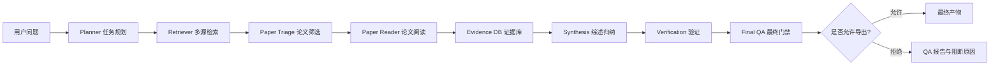
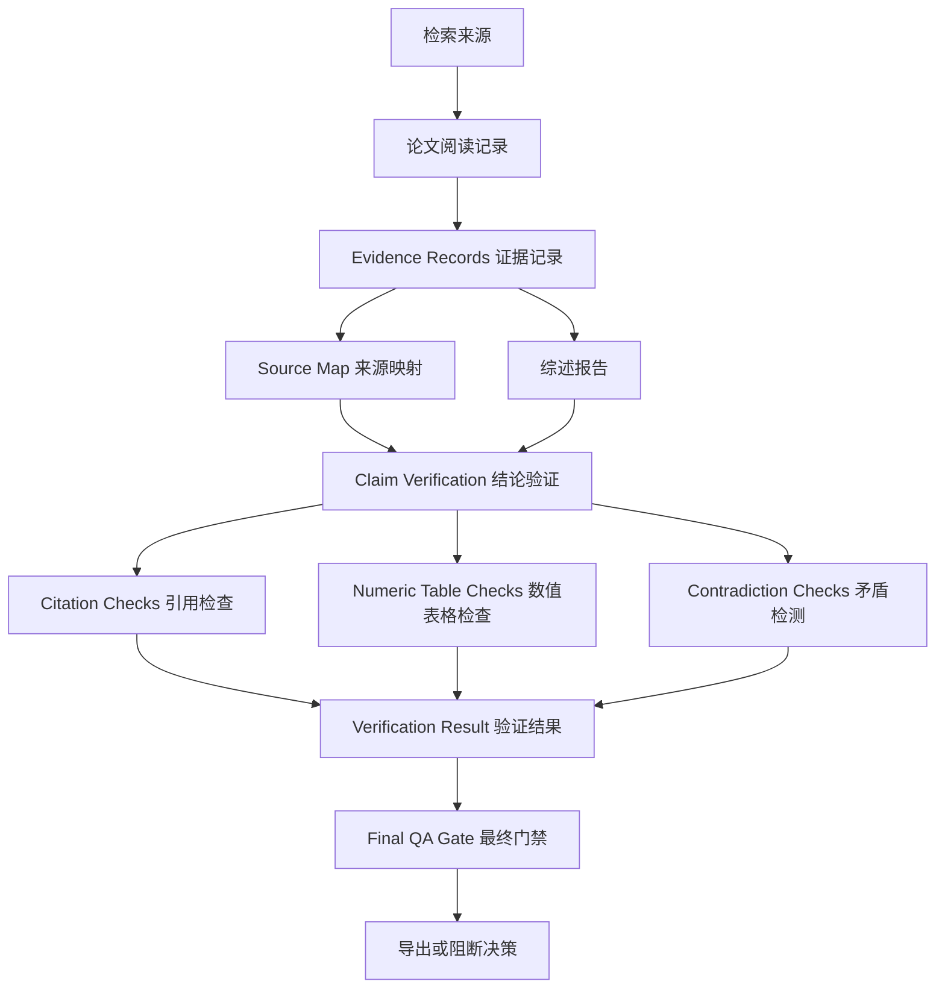

# Auto Research

[English](README.md) | [简体中文](README.zh-CN.md)

Auto Research 是一个开源的 **全自动科研助理 / 自动文献调研 Agent 系统**。你只需要输入一个研究问题，它就会自动完成任务规划、多源检索、论文排序、摘要和 PDF 阅读、证据抽取、综述归纳、结论验证、Final QA 门禁，并输出一组可检查、可追踪、可复现的研究产物。

它不是一个只会“帮你总结论文”的聊天机器人，而是一个面向真实科研流程的 **自动科研工作台**：每一步都有文件产物，每个关键结论都尽量绑定证据，每次运行都可以被审计、复盘和 benchmark。

一句话：

```text
输入研究问题 -> 自动跑完整科研流水线 -> 输出带证据链的研究报告和 QA 决策
```

Auto Research 的目标是让科研调研更快，但不牺牲可信度。项目默认保守、可验证、低幻觉：生成文本不会被当作证据，不支持的结论会被标记或阻止导出，证据不足时 Final QA 可以拒绝发布最终报告。

## 为什么需要 Auto Research

很多研究 Agent demo 停留在“搜索几篇论文，然后写一段总结”。Auto Research 更进一步：它把完整科研流程拆成可执行、可验证、可评估的流水线。

它重点解决 AI 科研里最关键的几个问题：

- 每个结论由哪个来源支撑？
- 系统读的是全文，还是只有摘要和元数据？
- 数值结论是否来自抽取出的表格？
- 引用格式和外部元数据是否可信？
- 不同证据之间是否存在矛盾？
- 最终报告是否可以安全导出？

Auto Research 会把这些检查变成明确文件，例如 `papers.csv`、`ranked_papers.csv`、`evidence_store.jsonl`、`source_map.json`、`verification_result.json`、`final_qa_report.md` 等。

## 它有什么不一样

- **不是一次性 Prompt，而是 Agent 流水线**：Planner、Retriever、Triage、Reader、Evidence、Synthesis、Verifier、QA、Writer、Benchmark 分阶段协作。
- **证据优先**：关键 claim 必须尽量回指到 evidence record，而不是只相信模型生成的文字。
- **带最终门禁**：流程可以跑完，但如果证据不足，Final QA 会拒绝导出 publication-style 结果。
- **没有 API key 也能跑**：离线 demo 和测试默认可运行；有 key 时再开启可选 LLM 写作增强。
- **适合 GitHub 项目化发展**：模块化 Python 包、测试、CI、示例、CLI、机器可读产物都已具备。
- **天然可评测**：benchmark 不只评估最终回答，而是评估检索、筛选、阅读、证据、综述、验证、Final QA 和端到端安全导出。

## 一条命令开始自动调研

```bash
python3 -m orchestrator.src.orchestrator \
  'survey evaluation methods for research agents' \
  --execute \
  --min-sources 2
```

运行后会在 `output/` 下生成一个项目目录，里面包含检索结果、阅读记录、证据库、综述报告、验证报告和最终 QA 决策。

## 核心流程

### 流程总览



```text
用户问题
  -> Planner 任务规划
  -> Retriever 多源检索
  -> Paper Triage 论文筛选
  -> Paper Reader 论文阅读
  -> Evidence DB 证据库
  -> Synthesis 综述归纳
  -> Verification 验证
  -> Final QA 最终门禁
```

可选模块包括方法对比、idea 生成、方法设计、实验规划、结果评估、rebuttal 草稿、推广材料、最终写作和 benchmark。

### 证据追踪与 QA



## 功能特性

- 基于 DAG 的多阶段研究工作流编排。
- 支持 arXiv、Semantic Scholar、OpenAlex、Crossref、OpenReview、PubMed、GitHub 和本地 PDF。
- 论文排序、筛选和 triage。
- 支持摘要、元数据、本地 PDF 和下载 PDF 的阅读。
- 安装 PyMuPDF 后可进行 layout-aware PDF 解析，抽取 section、table、formula 和 page/bbox 信息。
- 生成稳定的 evidence ID 和 source map。
- 基于证据生成综述、时间线、方法分类、research gap 和复现路线。
- 支持 citation metadata check、provider-exposed citation graph check、数值表格检查和语义归一化矛盾检测。
- Final QA 在导出前进行严格门禁。
- 支持 artifact-level 和 dataset-level benchmark。
- 可选 LLM 辅助写作，但 LLM 输出不会被当作新证据。

## 安装

需要 Python 3.10+。

```bash
python3 -m pip install -e .
```

可选 PDF layout 解析支持：

```bash
python3 -m pip install -e ".[pdf]"
```

核心测试和离线 demo 不需要 API key。

## 快速开始

运行一个文献调研流程：

```bash
python3 -m orchestrator.src.orchestrator \
  'large language model agent evaluation methods' \
  --execute \
  --min-sources 2
```

输出会写入：

```text
output/<project_id>/
```

只生成计划文件，不执行 DAG：

```bash
python3 -m orchestrator.src.orchestrator \
  '帮我调研一个科研主题的方法脉络，并生成一个 PPT 大纲' \
  --output-format ppt
```

启用外部引用和权威元数据检查：

```bash
python3 -m orchestrator.src.orchestrator \
  'scientific literature retrieval and evidence-grounded synthesis' \
  --execute \
  --enable-authority-checks \
  --min-sources 2
```

以 dry-run 模式运行实验规划节点：

```bash
python3 -m orchestrator.src.orchestrator \
  '帮我规划一个研究方法的验证流程' \
  --execute \
  --run-experiments
```

启用可选 LLM 辅助写作：

```bash
export OPENAI_API_KEY="your_api_key"
python3 -m orchestrator.src.orchestrator \
  '帮我写一个科研主题的论文综述' \
  --execute \
  --use-llm \
  --llm-provider openai \
  --llm-model gpt-4.1-mini
```

## 离线 Demo

运行不需要网络的本地 demo：

```bash
python3 examples/demo/run_demo.py
```

输出目录：

```text
output/demo_local_pdf/
```

## Benchmark

运行 artifact-level benchmark：

```bash
python3 -m orchestrator.src.orchestrator \
  'scientific literature review benchmark' \
  --execute \
  --run-benchmark \
  --benchmark-spec examples/demo/benchmark_spec.json \
  --min-sources 2
```

对已完成的 run 运行 dataset-level benchmark：

```bash
python3 -m benchmark.src.dataset_runner \
  --dataset examples/demo/benchmark_dataset.json \
  --output-dir output/benchmark_dataset_demo
```

## 关键输出

- `research_plan.json`：结构化研究计划。
- `task_graph.json`：DAG 任务图和依赖关系。
- `papers.csv`：检索到的论文元数据。
- `ranked_papers.csv`：排序和筛选后的论文。
- `paper_readings.jsonl`：逐篇论文阅读记录。
- `paper_layout_blocks.jsonl`：PDF layout block。
- `paper_sections.jsonl`：section 候选。
- `paper_tables.jsonl`：表格候选。
- `paper_structured_tables.jsonl`：结构化表格候选。
- `paper_structured_tables.csv`：长表格式表格单元格。
- `paper_formulas.jsonl`：公式候选。
- `evidence_store.jsonl`：可追溯证据记录。
- `source_map.json`：证据到来源的映射。
- `report.md`：基于证据的综述报告。
- `verification_report.md`：验证报告。
- `verification_result.json`：机器可读验证结果。
- `citation_graph_checks.jsonl`：provider 暴露的引用图检查。
- `final_qa_report.md`：最终 QA 报告。
- `final_decision.json`：最终流程决策。

## 低幻觉设计

- 缺失元数据保持为空，不自动编造。
- 只有摘要支撑的证据会被标记为 weak。
- 是否读取全文会被显式记录。
- PDF 表格、公式和 layout 输出都是候选，需要和原 PDF 核对。
- 外部 provider 失败会被记录为不确定，不会被解释为论文或引用不存在。
- Citation graph 只验证 provider 暴露出来的 references/citations。
- LLM 输出只是写作辅助，不是新证据来源。
- Final QA 可以完成流程但拒绝导出。

## 当前不做什么

Auto Research 不是：

- 可直接替代科研人员的自动科学家。
- 专家文献综述的替代品。
- 不依赖 provider 覆盖率的全知 citation truth oracle。
- 保证准确的 PDF 表格/公式解析器。
- 已验证的科学指标抽取器。
- 可替代真实审稿意见和人工确认的 rebuttal 系统。

## 测试

运行完整本地测试：

```bash
python3 -m unittest discover -s planner/tests
python3 -m unittest discover -s orchestrator/tests
python3 -m unittest discover -s retriever/tests
python3 -m unittest discover -s paper_triage/tests
python3 -m unittest discover -s paper_reader/tests
python3 -m unittest discover -s evidence_db/tests
python3 -m unittest discover -s synthesis/tests
python3 -m unittest discover -s verification/tests
python3 -m unittest discover -s final_qa/tests
python3 -m unittest discover -s benchmark/tests
python3 -m unittest discover -s comparison/tests
python3 -m unittest discover -s idea_generation/tests
python3 -m unittest discover -s method_design/tests
python3 -m unittest discover -s experiment/tests
python3 -m unittest discover -s evaluation/tests
python3 -m unittest discover -s rebuttal/tests
python3 -m unittest discover -s promotion/tests
python3 -m unittest discover -s writer/tests
python3 -m unittest discover -s llm/tests
```

当前本地状态：

```text
82 tests passing
```

## 目录结构

```text
orchestrator/      DAG 规划与任务执行
planner/           查询和检索条件规划
retriever/         多源论文元数据检索
paper_triage/      论文排序与筛选
paper_reader/      摘要/PDF 阅读与 layout 抽取
evidence_db/       Evidence ID 和 source map
synthesis/         基于证据的综述生成
verification/      Claim、citation、数值和矛盾检查
final_qa/          最终导出门禁
benchmark/         Artifact 和 dataset benchmark
comparison/        文献矩阵和 benchmark 矩阵
experiment/        实验规划和受控执行
writer/            最终报告组装和可选 LLM 摘要
examples/demo/     离线 demo
```

## License

MIT License.
